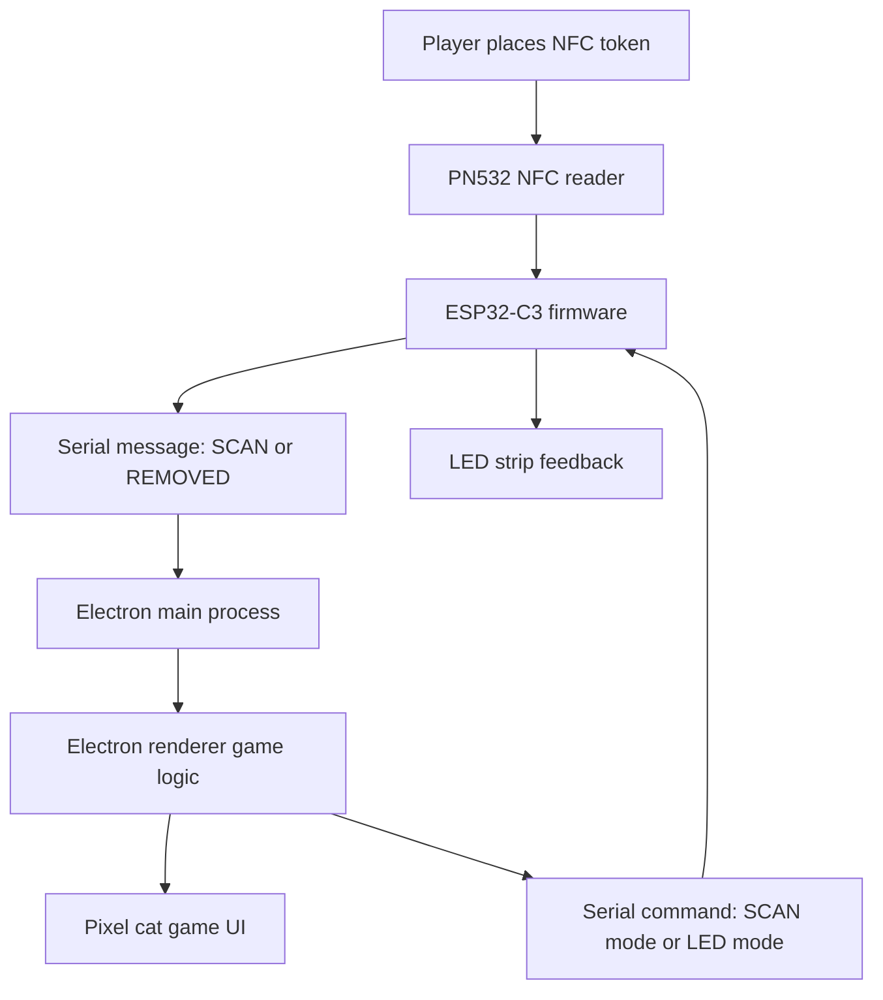
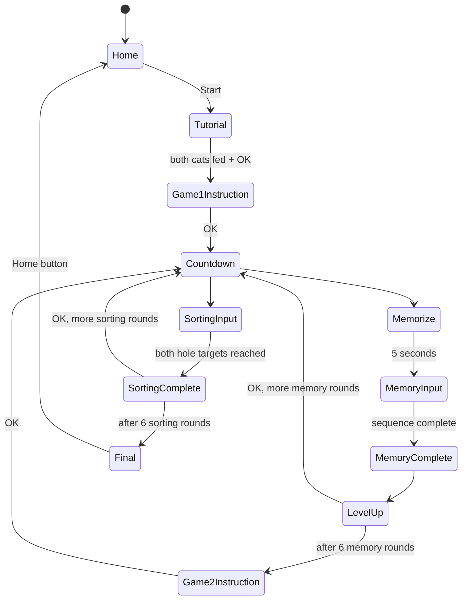

# Kitten Nibbles Game Documentation

## Overview

**Kitten Nibbles** is an NFC-based cognitive game where players feed pixel cats by placing physical shape/color tokens into left and right scanning holes.

The experience is designed to feel playful and approachable while exercising:

- Working memory
- Attention and sequencing
- Sorting by visual characteristics
- Hand-eye coordination
- Response speed and accuracy

The project combines:

- An **Electron desktop app** for the game interface
- An **ESP32-C3 firmware** for NFC readers and LEDs
- Two **PN532 NFC readers**, one for each hole
- A **16 LED strip** for visual feedback
- Physical NFC-tagged tokens with color and shape identities

The game is currently implemented as a 12-round session:

- **Game 1: Memory**, 6 rounds
- **Game 2: Sorting**, 6 rounds

## Player Experience

### Home Screen

The player starts on a pixel-art home screen with the game title and a cat character.

Available actions:

- Press **Start** to begin.
- Use the language toggle on the home screen to switch between English and Simplified Chinese.
- Staff can open settings to connect the MCU and view serial/debug information.

The language toggle only appears on the home screen. The app resets to English each time it opens.

### Tutorial

Before the game begins, players see a tutorial screen with two cats:

- Left cat represents the left hole.
- Right cat represents the right hole.

The tutorial teaches the core mechanic:

- Place a token into a hole to feed the cat.
- The cat is only fed when the LED flashes blue.
- The player must successfully feed both cats once before the **OK** button appears.

During the tutorial, both NFC readers are active. Any valid game token can feed either cat.

### Countdown

Before playable rounds begin, the screen switches to a plain white countdown:

```text
3
2
1
```

Scanning is disabled during countdowns.

## Game 1: Memory

Game 1 is a sequence memory game.

### Round Structure

There are 6 memory rounds. Sequence length increases like this:

| Memory round | Sequence length |
| --- | --- |
| 1 | 3 |
| 2 | 3 |
| 3 | 4 |
| 4 | 5 |
| 5 | 5 |
| 6 | 6 |

Each round randomly chooses:

- One active hole: left or right
- One attribute type: color or shape
- A sequence of expected values

Example:

```text
Active hole: LEFT
Attribute: shape
Sequence: TRIANGLE -> SQUARE -> OVAL
```

### Memorization Phase

The screen displays the sequence for 5 seconds.

The UI shows:

- The sequence boxes
- A large decreasing clock animation
- A message asking the player to remember the sequence

Scanning is disabled during this phase.

### Input Phase

After the memorization phase:

- The sequence boxes become blank.
- The cat appears.
- Only the selected active hole is scanned.
- The LED section for the selected hole lights yellow.

The player feeds tokens into the active hole in the remembered order.

When a token is accepted:

- That hole flashes blue.
- The cat performs the eating animation.
- The scanned token appears in the next blank box.

If the player scans through the wrong hole, the scan is ignored.

If the player scans the wrong token through the correct hole, it still counts as the next input and affects accuracy.

### Round Complete

When the full sequence has been entered:

- Scanning stops.
- If every item is correct, LEDs show green sparkles.
- If any item is wrong, LEDs show red sparkles.
- The round complete screen shows the boxes as green/red based on correctness.
- The cat expression changes based on the result.
- A level-up screen appears with an **OK** button to move on.

## Game 2: Sorting

Game 2 is a sorting and executive-function game.

There are 6 sorting rounds.

Each round asks the player to feed two cats based on either:

- Color
- Shape

The left and right holes each receive a different target.

Example color round:

```text
Left hole: PURPLE
Right hole: YELLOW
```

Example shape round:

```text
Left hole: PENTAGON
Right hole: SQUARE
```

### Sorting Round Structure

Each sorting round randomly chooses:

- Attribute type: color or shape
- Left target
- Right target
- Number of required tokens per hole

Targets are randomized from 1 to 4 scans per hole.

During sorting:

- Both holes are active.
- Each hole has its own cat.
- Each cat panel shows the requested color or shape.
- Each panel shows how many tokens have been scanned.

For color sorting rounds:

- The LEDs for each hole stay lit in the requested color.

For shape sorting rounds:

- LEDs use white as the base prompt color.

When a token is scanned:

- The corresponding hole flashes blue.
- That hole's cat eats.
- The count for that hole increases.

Incorrect tokens still count toward the hole total, but they reduce accuracy.

### Sorting Round Complete

When both holes reach their required count:

- Scanning stops.
- LEDs show green sparkles if all scans were correct.
- LEDs show red sparkles if any scan was wrong.
- Both cats jump on the round-complete screen.
- The player presses **OK** to move to the next round.

There is no level-up screen during Game 2.

## End Screen

After all 12 rounds, the game shows:

- Final score
- Accuracy
- Active play time
- Staff results table
- **Home** button

The Home button resets the session state and returns to the start screen while keeping the board connection active.

The LED strip switches to a rainbow animation on the final screen.

## Scoring and Timing

The game records each accepted scan with:

- Round number
- Mode: memory or sorting
- Hole: left or right
- UID
- Expected value
- Actual value
- Correctness
- Timestamp

At the end of each round, the app records:

- Round duration
- Number of correct scans
- Number of total scans
- Round mode
- Attribute type

The current score formula is:

```text
score = accuracy_component + speed_component
```

Where:

```text
accuracy_component = accuracy_percent * 800
speed_component = min(200, 15000 / total_active_seconds)
```

The final score is out of approximately 1000 points.

Accuracy is based on accepted scans. Ignored scans, such as scans from the wrong hole during memory mode, are not counted.

## SQLite Storage

The Electron app stores completed sessions in a local SQLite database inside the project folder:

```text
order-stack-cognitive-rounds/kitten_nibbles.db
```

The database is managed by `desktop/database.js` through the system `sqlite3` command.

If an older database exists in Electron's Application Support folder, the app copies it into the project folder the first time the project database is missing.

### Tables

| Table | Purpose |
| --- | --- |
| `participants` | Stores each unique participant ID and display name |
| `sessions` | Stores one completed game session and the final monitoring rating |
| `baselines` | Stores the first completed session for each participant as the comparison baseline |
| `game2_blocks` | Stores Game 2 block summaries for shape/color switching analysis |
| `game2_trials` | Stores accepted Game 2 token placements only, not raw repeated scanner reads |

### Participant Data

The home screen asks for:

- Participant ID
- Participant name

`participant_id` is the unique key used to connect multiple sessions for the same person.

### Session Data

Each completed game stores:

- Total score
- Total accuracy
- Total active game time
- Game 1 accuracy
- Game 2 accuracy
- Score rating
- Executive rating
- Overall monitoring status
- Flag reason
- Data quality flag

The first completed session for a participant becomes the baseline.

### Game 2 Monitoring Data

Game 2 stores accepted placements and block summaries so the app can calculate:

- Reaction time per accepted placement
- Switch vs repeat trial reaction time
- Switch cost
- Switch error cost
- Adaptation cost after switching
- Perseverative errors, where the player follows the old rule after the rule changes

Raw NFC noise is not stored. Cooldown reads, removed events, and repeated stuck-token scans are excluded.

### Rating Logic

The Electron app calculates ratings after each completed game:

```text
ESP32-C3 = sensors and LEDs
Electron = score and monitoring calculations
SQLite = storage
```

The staff-facing monitoring status can be:

- `baseline`
- `stable`
- `watch`
- `flagged`

The final monitoring status is based on two paths:

- Overall score decline from baseline
- Executive-function decline from Game 2 switching metrics

The SQL database stores the calculated result and the reason; it does not make the clinical decision by itself.

## Token System

Each physical token is identified by its NFC UID.

Each UID maps to:

- A token name
- A color
- A shape

Current token categories:

| Token family | Color | Shape |
| --- | --- | --- |
| Blue triangle | Blue | Triangle |
| Yellow square | Yellow | Square |
| Green oval | Green | Oval |
| Red hexagon | Red | Hexagon |
| Purple pentagon | Purple | Pentagon |

There are three physical tags for each family, giving 15 valid tokens total.

Unknown tags are ignored in the tutorial and treated as `UNKNOWN` during gameplay if accepted through the active scanner.

## Hardware Architecture

### Main Components

| Component | Purpose |
| --- | --- |
| ESP32-C3 | Runs firmware for readers and LEDs |
| PN532 left reader | Detects tokens in the left hole |
| PN532 right reader | Detects tokens in the right hole |
| WS2812B LED strip | Shows prompts, scan feedback, results, and rainbow final state |
| Electron desktop app | Runs the visual game UI and session logic |

### NFC Reader Setup

The firmware uses two PN532 readers on a shared SPI bus.

Current firmware constants in `src/main.cpp`:

| Signal | ESP32-C3 GPIO |
| --- | --- |
| SCK | GPIO4 |
| MISO | GPIO5 |
| MOSI | GPIO6 |
| Left reader SS | GPIO3 |
| Right reader SS | GPIO9 |

### LED Setup

The firmware uses FastLED.

Current firmware constants in `src/main.cpp`:

| LED setting | Value |
| --- | --- |
| LED type | WS2812B |
| Data pin | GPIO8 |
| LED count | 16 |
| Color order | GRB |

The strip is split into two sections:

| LED range in firmware | Game side |
| --- | --- |
| `LEFT_LED_START` to `LEFT_LED_END` | Left hole |
| `RIGHT_LED_START` to `RIGHT_LED_END` | Right hole |

## Software Architecture



### Electron App

The Electron app is split into:

| File | Role |
| --- | --- |
| `desktop/main.js` | Opens the window and manages serial connection |
| `desktop/preload.js` | Exposes safe serial APIs to the renderer |
| `desktop/renderer/index.html` | Defines the UI shell |
| `desktop/renderer/styles.css` | Pixel-art visual design |
| `desktop/renderer/renderer.js` | Game state, rounds, scoring, UI rendering, serial commands |

The renderer owns the game state:

- Current phase
- Current round
- Memory sequence
- Sorting targets
- Scan history
- Round records
- Language mode
- Score data

### Firmware

The firmware in `src/main.cpp` owns:

- PN532 setup
- Reader polling
- Tag removal detection
- Scan mode control
- LED mode control
- Serial protocol handling

The firmware does not decide game correctness. It only reports NFC events and performs LED feedback based on commands from the Electron app.

## Serial Protocol

The Electron app and firmware communicate over USB serial at 115200 baud.

### Firmware to Electron

When a tag is detected:

```text
SCAN|HOLE:LEFT|UID:53:F2:7D:74:95:00:01
```

or:

```text
SCAN|HOLE:RIGHT|UID:53:79:79:74:95:00:01
```

When a tag leaves a reader:

```text
REMOVED|HOLE:LEFT
```

or:

```text
REMOVED|HOLE:RIGHT
```

### Electron to Firmware

Scan control:

| Command | Meaning |
| --- | --- |
| `SCAN:OFF` | Disable scanning |
| `SCAN:LEFT` | Scan left reader only |
| `SCAN:RIGHT` | Scan right reader only |
| `SCAN:BOTH` | Scan both readers |

LED control:

| Command | Meaning |
| --- | --- |
| `LED:OFF` | Turn LEDs off |
| `LED:MEMORY:LEFT` | Light left side for memory |
| `LED:MEMORY:RIGHT` | Light right side for memory |
| `LED:SCAN:LEFT` | Flash left side blue |
| `LED:SCAN:RIGHT` | Flash right side blue |
| `LED:SORT:LEFT:<color>:RIGHT:<color>` | Set sorting prompt colors |
| `LED:SUCCESS` | Green sparkle result |
| `LED:ERROR` | Red sparkle result |
| `LED:RAINBOW` | Final rainbow animation |

## Game State Flow



## Accessibility and UX Choices

The game is designed for older adults and physical interaction:

- Large, high-contrast text
- Simple short instructions
- Clear left/right hole labels
- Large token boxes
- Blue flash as scan confirmation
- Animated cats as friendly feedback
- Scanning disabled during instructions and countdowns
- Only the correct hole is active during memory rounds
- Player-facing language toggle on the home screen
- Staff/debug area kept separate from gameplay

## Running the Project

### Upload Firmware

```bash
pio run -t upload
```

### Start Electron App

```bash
npm install
npm start
```

### Normal Setup Flow

1. Open the app.
2. Open staff settings.
3. Refresh serial ports.
4. Connect the MCU.
5. Close settings.
6. Choose English or Chinese on the home screen if needed.
7. Press Start.
8. Complete the tutorial.
9. Play through Game 1 and Game 2.
